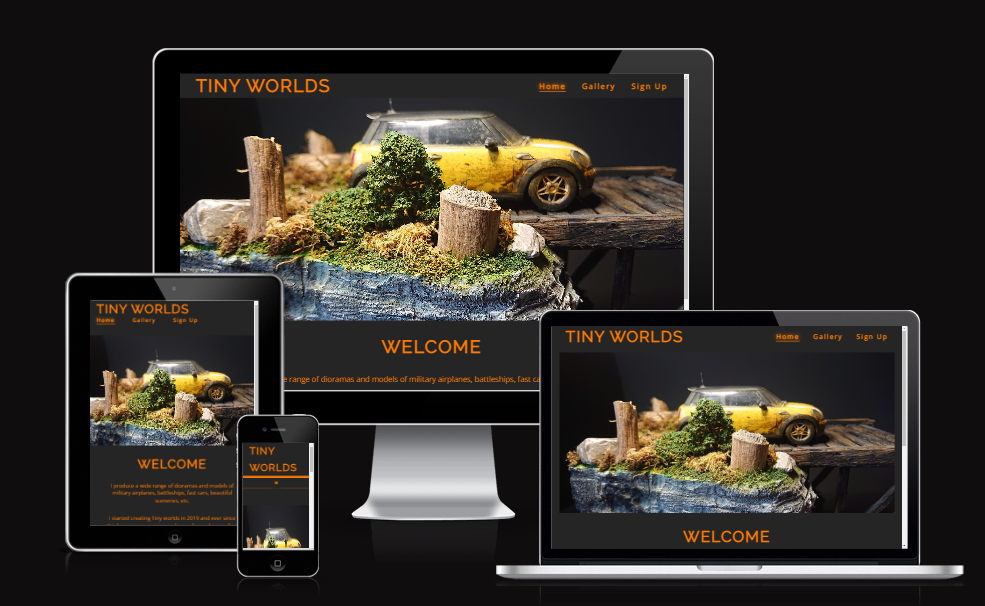

#TINY WORLDS

[Visit the website here](https://fbartosz86.github.io/Tiny-Worlds/)

I created this website to share with people an amazing hobby which is building models and dioramas.
---
This website is made up of the following sections:

1. Home page;
2. Gallery;
3. Sign up page to the Tiny Worlds Newsletter;
4. Thank you for signing up page.
---
The business goals for this website are:

1. To share the passion for building dioramas and models;
2. To inspire users by giving them examples and ideas;
3. To build a database of users to send future information & content to, furthering the reach of the author.

The user goals of this website are:
1. As a first-time visitor, I want to easily find examples of the finished projects.
2. As a first-time user, I want to be able to sign up to directly receive content via a newsletter.

---
## Technologies Used 

I have used several technologies that have enabled this design to work:

- [HTML](https://developer.mozilla.org/en-US/docs/Web/HTML)
    - Used as the basic building block for the project and to structure the content.
- [CSS](https://developer.mozilla.org/en-US/docs/Learn/Getting_started_with_the_web/CSS_basics)
    - Used to style all the web content across the project. 
- [Font Awesome](https://fontawesome.com/)
    - Used to obtain the social media icons used in the footer.
- [Google Developer Tools](https://developers.google.com/web/tools/chrome-devtools)
    - Used as a primary method of fixing spacing issues, finding bugs, and testing responsiveness across the project.
- [Google Fonts](https://developer.chrome.com/docs/devtools/)
    - Used to obtain the fonts linked in the header, fonts used were Playfair and Cookie.    
- [Grammarly](https://www.grammarly.com/)
    - Used to rectify any grammar errors.       
- [GitHub](https://github.com/)
    - Used to store code for the project after being pushed.
- [Git](https://git-scm.com/)
    - Used for version control by utilising the Gitpod terminal to commit to Git and Push to GitHub.
- [Gitpod](https://www.gitpod.io/)
    - Used as the development environment.
- [W3C Markup Validation Service](https://validator.w3.org/) 
    - Used to validate all HTML code written and used in this webpage.
- [W3C CSS Validation Service](https://jigsaw.w3.org/css-validator/#validate_by_input)
    - Used to validate all CSS code written and used in this webpage.
- [AmIResponsive](http://ami.responsivedesign.is/)
    - Used to generate repsonsive image used in README file.

---

---
## Credits

Inspired myself from the Love running project for the animated image from the home page, creating the nav bar, creating the social media links.

sources 
go to top button
https://www.w3schools.com/howto/howto_js_scroll_to_top.asp

gallery flex box
https://blog.logrocket.com/how-create-responsive-image-gallery-css-flexbox/

The structure of the readme file was taken from: [EAT HEALTHY WITH JDR](https://mikyrenato.github.io/1st-Project-Eat-Healty-With-JDR/jdrhome).

---
## Acknowledgements

I would like to thank my course mentor Jubril Akolade for his support and guidance throughout the course of the project, My amazing cousin Marcin Fraszczyk who is an author of all the models, dioramas, and pictures used on this website and kindly agree to use all of the materials and my fellow student Mihai Pape for constant motivation and moral support,  my colleague Marcin Placek and my boss Declan Phelan for their support & feedback.
