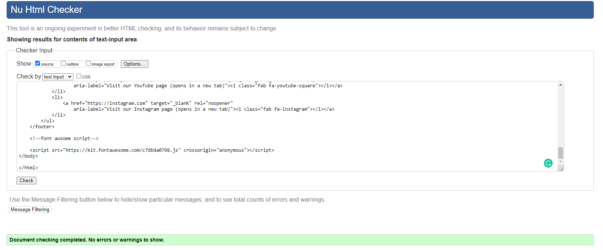

#TINY WORLDS

[Visit the website here](https://fbartosz86.github.io/Tiny-Worlds/)

I created this website to share with people an amazing hobby which is building models and dioramas.
---
This website is made up of the following sections:

1. Home page;
2. Gallery;
3. Sign up page to the Tiny Worlds Newsletter;
4. Thank you for signing up page.
---
The business goals for this website are:

1. To share the passion for building dioramas and models;
2. To inspire users by giving them examples and ideas;
3. To build a database of users to send future information & content to, furthering the reach of the author.

The user goals of this website are:
1. As a first-time visitor, I want to easily find examples of the finished projects.
2. As a first-time user, I want to be able to sign up to directly receive content via a newsletter.

## UX
---
### **Strategy**

Considering the core UX principles I first started to think about the strategy for this website and defined who the target users would be and what features/technologies they would want.

Tiny Worlds target users are:
* Aged 15-30+
* People looking for a new hobby.
* People who already building models and dioramas.

What these users would be looking for:
* Clear, concise, easy-to-find information.
* Beautiful photos that provide inspiration and make this hobby looks intresting.

This website will offer all of these things whilst also allowing for intuitive navigation and comfortability of use. An effort was taken to not provide an overwhelming amount of information at first glance as this is often the reason people are put off with this kind of websites. It is assumed that most users will be viewing the site on their mobile phones and therefore creating something responsive is integral to the design.

### **Scope**

In order to achieve the desired user & business goals, the following features will be included in this release:

- Header and menu bar, to navigate to various sections of the page.
- Gallery of images and videos with greate inspiring ideas.
- Newsletter sign up form.
- Links to affiliate social media pages.

### **Structure** 

This is a four pages website. The first page is the home page, which will give the users enough information about what this website is about. The navigation bar at the top allows users to easily move to whatever page of the site they are interested in or they can scroll down to where the social links can be found. I chose the following order for the information 'Home > Gallery > Sign up to the Tiny Worlds Newsletter, which after submitting will send you to a thank you page', as I felt this would allow the information to be digested in the best way. The second page is the Gallery, which will contain pictures with some great inspiring examples of build models and dioramas, followed by the social media links at the bottom. Finally, there is a simple sign-up form for users to sign up for the Tiny Worlds newsletter.

### **Skeleton**

Whilst building the website, at first I added all of the pictures of the project, later I realized that it was not easy to follow the projects so I rename each file and I decide to organize them by projects and add a section with videos at the end. Because the list was very long I decide to add a go to the top page button that will appear when you scroll down or choose to jump to one of the projects that are on the lower section of the gallery page.

### **Surface**

I chose a color palette based around dark gray & orange as these colors achieve a nice elegant contrast.
Orange is a very vibrant and energetic color. In its muted forms it can be associated with the earth and with autumn, the time when we spend more time at home and have more time for our hobbies and it is a known fact that the orange color is also strongly associated with creativity.
In designs, orange commands attention without being as overpowering as red. It’s often considered more friendly and inviting, and less in–your–face.

I used 'Open Sans' and 'Raleway' across the entire website. 'Open sans is here for readability, I used it for all the body elements beside heading where i used 'Releway' that rings an elegant, yet bold presence to any website

---

## **Features**

This is a fully responsive website that was designed for all devices like laptops, desktops, tablets and mobile phone.

### *Navbar*
The navbar is placed on the right-hand side of the head on the big screens then for tablets size screens it is moved to the left side to keep a clean view, and it turns into a "hamburger menu" for smaller screen sizes.

### *Home Page*
This is where I  Introduce the Tiny Worlds page with an animated image followed by H1 heading "WELCOME" followed by 3 paragraphs with few short not ooverwelming information about what I want to share with viewver of this weebpage, followed by social media links.

### *Gallery*
This page starts with the H1 Heading "LSIT OF PROJECTS", followed by a list of projects name hyperlinked to the relevant areas on the page to allow the viewer to choose and jump straight into the projects that cought their attention,  followed by some beautiful, inspiring images and videos grouped int the responsive flex box gallery, accompanied with go to the top page button and followed by the social media links.

### *Sign up*
This page is about signing up to Tiny Worlds Newsletters which will redirect the user to another "confirmation" page which is Thank you for signing up page with go back home button.

### *Social media links*
The Social media links can be found on all pages.

---
## Testing

### *Lighthouse*
Lighthouse is a feature of Google Chrome developer tools and is used to assess the performance of the website and its features. I achieved a low-performance score initially, as you can see below:

### *HTML and CSS Validation*
I used The W3C CSS and The W3C Markup Validation Service:

## Known bugs and fixes
### CSS
closing curly bracket was missing at the end of css file.
### Gallery
Error: Attribute alt not allowed on element iframe at this point - removed alt and replace it with a title atribute

Error: The frameborder attribute on the iframe element is obsolete. Use CSS instead - removed frameborder atribute
### Sign-UP
Error: The value of the for attribute of the label element must be the ID of a non-hidden form control - alocete for atribute to corect id.

---
## Technologies Used 

I have used several technologies that have enabled this design to work:

- [HTML](https://developer.mozilla.org/en-US/docs/Web/HTML)
    - Used as the basic building block for the project and to structure the content.
- [CSS](https://developer.mozilla.org/en-US/docs/Learn/Getting_started_with_the_web/CSS_basics)
    - Used to style all the web content across the project. 
- [Font Awesome](https://fontawesome.com/)
    - Used to obtain the social media icons used in the footer.
- [Google Developer Tools](https://developers.google.com/web/tools/chrome-devtools)
    - Used as a primary method of fixing spacing issues, finding bugs, and testing responsiveness across the project.
- [Google Fonts](https://developer.chrome.com/docs/devtools/)
    - Used to obtain the fonts linked in the header, fonts used were Playfair and Cookie.    
- [Grammarly](https://www.grammarly.com/)
    - Used to rectify any grammar errors.       
- [GitHub](https://github.com/)
    - Used to store code for the project after being pushed.
- [Git](https://git-scm.com/)
    - Used for version control by utilising the Gitpod terminal to commit to Git and Push to GitHub.
- [Gitpod](https://www.gitpod.io/)
    - Used as the development environment.
- [W3C Markup Validation Service](https://validator.w3.org/) 
    - Used to validate all HTML code written and used in this webpage.
- [W3C CSS Validation Service](https://jigsaw.w3.org/css-validator/#validate_by_input)
    - Used to validate all CSS code written and used in this webpage.
- [AmIResponsive](http://ami.responsivedesign.is/)
    - Used to generate repsonsive image used in README file.

---
## Deployment

---
## Credits

Inspired myself from the Love running project for the animated image from the home page, creating the nav bar, creating the social media links.

sources 
go to top button
https://www.w3schools.com/howto/howto_js_scroll_to_top.asp

gallery flex box
https://blog.logrocket.com/how-create-responsive-image-gallery-css-flexbox/

The structure of the readme file was taken from: [EAT HEALTHY WITH JDR](https://mikyrenato.github.io/1st-Project-Eat-Healty-With-JDR/jdrhome).

---
## Acknowledgements

I would like to thank my course mentor Jubril Akolade for his support and guidance throughout the course of the project, My amazing cousin Marcin Fraszczyk who is an author of all the models, dioramas, and pictures used on this website and kindly agree to use all of the materials and my fellow student Mihai Pape for constant motivation and moral support,  my colleague Marcin Placek and my boss Declan Phelan for their support & feedback.
